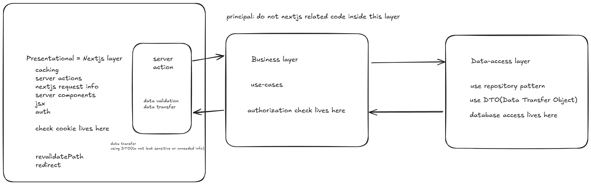

https://app.gumroad.com/d/d4921cd7dd380c6757b47058f5be99d0

12-23

커스텀 디버깅 페이지 아래 앱컨픽 사용

앱상태 컨픽

- 1. 랜딩
- 2. 점검중
- 3. 커밍 순

폴더 구조

(docs) 인앱 독스 추가부분

(main) 실제 데모 앱 추가 부분

lib - 외부 라이브러리 사용 부분

외부 라이브러리 개요

nextjs-toploader - 내부 내비게이션 시 로딩 바
cslx - 클래스에 조건을 거는 등 더 쉽게 사용가능
twmerge - tailwinds 클래스를 합치는 과정에서(리액트 프롭으로 받을 때) 더 쉽게 넣을 수 있음
lucide-react - icon 모음 및 svg 그리기

```
// 사용법

export function cn(...inputs: ClassValue[]) {
  return twMerge(clsx(inputs));
}

<Component
      className={cn("px-5 py-14 md:px-6 md:py-20 lg:py-24", className)}
      {...restProps}
    >
      <div className="mx-auto flex w-full max-w-7xl flex-col items-center">
        {children}
      </div>
    </Component>

```

커스텀 테스팅 모달 -> 앱 컨픽 상태 변경할 수 있도록

12/24

radix react/slot 확인하기

- polymophism을 위해 사용

This is a [Next.js](https://nextjs.org) project bootstrapped with [`create-next-app`](https://nextjs.org/docs/app/api-reference/cli/create-next-app).

12/25

커밍순 페이지
랜딩 페이지 작성 중

12/28

- done
  added cva for css variants
  added sign in button

- [x] `@radix-ui/react-alert-dialog`: `1.1.2`
- [x] `@radix-ui/react-avatar`: `1.1.1`
- [ ] `@radix-ui/react-checkbox`: `1.1.2`
- [x] `@radix-ui/react-dialog`: `1.1.2`
- [ ] `@radix-ui/react-dropdown-menu`: `2.1.2`
- [x] `@radix-ui/react-label`: `2.1.0`
- [ ] `@radix-ui/react-popover`: `1.1.2`
- [ ] `@radix-ui/react-scroll-area`: `1.2.1`
- [ ] `@radix-ui/react-select`: `2.1.2`
- [x] `@radix-ui/react-slot`: `1.1.0`
- [ ] `@radix-ui/react-switch`: `1.1.1`
- [x] `@radix-ui/react-tabs`: `1.1.1`
- [x] `@radix-ui/react-toast`: `1.2.2`
- [ ] `@radix-ui/react-tooltip`: `1.1.4`

- to be done
  푸터
  테마
  © 2024 Group Finder. All Rights Reserved. Built with ❤️ by Groupie, LLC

  12/30

  서버액션 단점: 3rd party에게 api를 노출하기 힘듬

  12/31

  컴포넌트에 React.forwardRef를 붙이는 이유. 타입설정 가능 + ref 이름으로 넘기면 리액트에서 에러 띄움
  https://stackoverflow.com/questions/70150131/why-do-we-need-react-forwardref-if-we-can-simple-pass-the-created-ref-in-props

  next docs 에서 Link 이하의 children에서 compoenent를 불러올 경우 사용 불가능함. 아래 docs 확인

  https://nextjs.org/docs/pages/api-reference/components/link#if-the-child-is-a-functional-component

  1/1

  fumadocs/mdx 세팅 추가

  1/2

  known issue: Hydration failed because the server rendered HTML didn't match the client. As a result this tree will be regenerated on the client. This can happen if a SSR-ed Client Component used
  RootLayout의 RootProvider 참고 fumadocs

  1/3

  위 이슈 해결 html에 suppressHydrationWarning 추가

  

```
// e.g.) 해당 nextjs에서 use-case의 비즈니스 로직 호출

export default async function DangerTab({
  params,
}: {
  params: Promise<{ groupId: string }>;
}) {
  const { groupId } = await params;
  const groupIdInt = parseInt(groupId);
  const user = await assertAuthenticated();
  const group = await getGroupByIdUseCase(user, groupIdInt);

  if (!group) {
    return <div>Group not found</div>;
  }
  ...
}


```

```

// use-case 내부에서는 유저가 어떤 데이터인지 신경쓰지 않음. 해당 유저데이터를 근거로 db에 명령을 전달할 뿐.

export async function getGroupByIdUseCase(
  authenticatedUser: UserSession,
  groupId: GroupId
) {
  await assertGroupMember(authenticatedUser, groupId);
  // 그룹이 존재하지 않거나 유저가 그룹 오너가 아니라면 에러, use case 안에서 유저가 어떤 유저인지 판별함.
  // 프론트에서는 보여주는 데이터를 보여줄 뿐이지, 프론트에서 유저 스테이터스를 받고 해당 유저가 그룹 오너인지 판별할 필요가 없음
  return await getGroupById(groupId);
}
```

01/06

docker 환경에서 postgres 추가
drizzle 데이터베이스 킷 추가

env, schema, docker compose, dockerfile 확인
package.json 의 db 관련 커맨드 확인

task: db 폴더 확인
index: 보일러플레이트 + env
seed: 시작 데이터 추가
clear: 디비 지우기

signin 메소드
세션 추가 필요
getCurrentUser 메소드

01/07

01/08

유저 관련 기능 추가 - 프로파일 변경, 탈퇴

---

비밀번호 찾기

docs 페이지 mdx 렌더링 추가
docs 스켈레톤 추가 - 회원가입 / 로그인

작성 중 문제: 로그인 이후 header 업데이트 안되는 상황 확인중

- page에 cache되지 않는 액션을 추가하는 것으로 해결.

회원가입 폼

01/10

tiptaps 추가

profile / settings 추가

---

프로파일 레이아웃 추가(해더, 탭)
비밀번호 찾기

---

비밀번호 찾기 onhold

01/13

actions.ts의 코드 구조 동일하게 할 것

- 에러는 actions에서 던질 것

서버에서의 error boundary

- 중요한 점은 여기서 string meassage가 없는 에러인 경우 아래처럼 something when wrong만 내보내는데 이 이유는 중요한 인포를 해커에게 노출시키지 않기 위함임.

```
function shapeErrors({ err }: any) {
  const isAllowedError = err instanceof PublicError;
  // let's all errors pass through to the UI so debugging locally is easier
  const isDev = env.NODE_ENV === "development";
  if (isAllowedError || isDev) {
    return {
      code: err.code ?? "ERROR",
      message: `${!isAllowedError && isDev ? "DEV ONLY ENABLED - " : ""}${
        err.message
      }`,
    };
  } else {
    return {
      code: "ERROR",
      message: "Something went wrong",
    };
  }
}

```

실제 deployment

최소 가격을 생각하면

db - supabase 무료 플랜으로 두개의 postgre 유지 가능.
레일웨이 - 에서 dockerfile의 커맨드를 run.sh로 올려서 사용함 단 하나의 워커만을 사용하는것에 유의할 것

## Getting Started

First, run the development server:

```bash
npm run dev
# or
yarn dev
# or
pnpm dev
# or
bun dev
```

Open [http://localhost:3000](http://localhost:3000) with your browser to see the result.

You can start editing the page by modifying `app/page.tsx`. The page auto-updates as you edit the file.

This project uses [`next/font`](https://nextjs.org/docs/app/building-your-application/optimizing/fonts) to automatically optimize and load [Geist](https://vercel.com/font), a new font family for Vercel.

## Learn More

To learn more about Next.js, take a look at the following resources:

- [Next.js Documentation](https://nextjs.org/docs) - learn about Next.js features and API.
- [Learn Next.js](https://nextjs.org/learn) - an interactive Next.js tutorial.

You can check out [the Next.js GitHub repository](https://github.com/vercel/next.js) - your feedback and contributions are welcome!

## Deploy on Vercel

The easiest way to deploy your Next.js app is to use the [Vercel Platform](https://vercel.com/new?utm_medium=default-template&filter=next.js&utm_source=create-next-app&utm_campaign=create-next-app-readme) from the creators of Next.js.

Check out our [Next.js deployment documentation](https://nextjs.org/docs/app/building-your-application/deploying) for more details.
